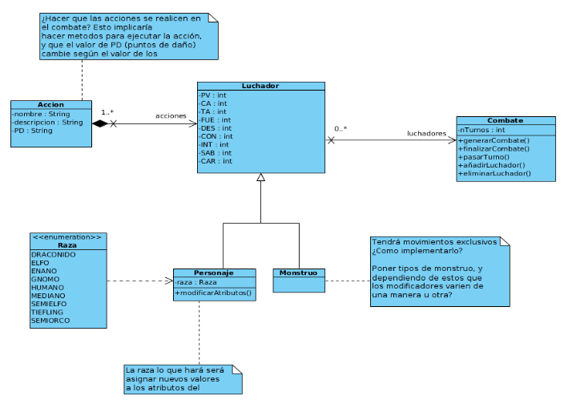
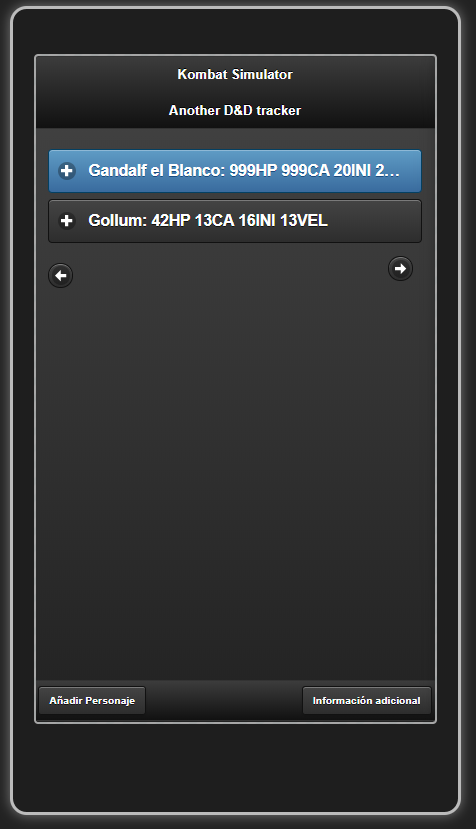
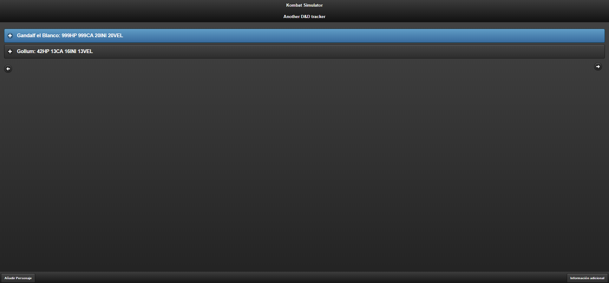
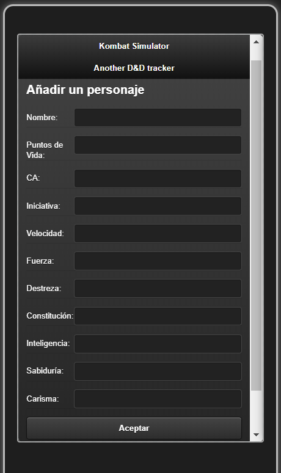
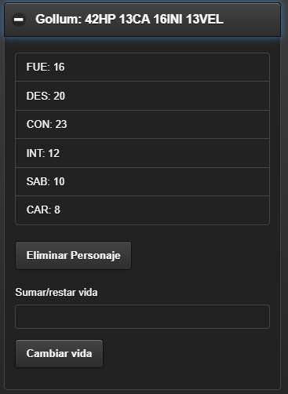
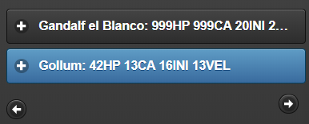
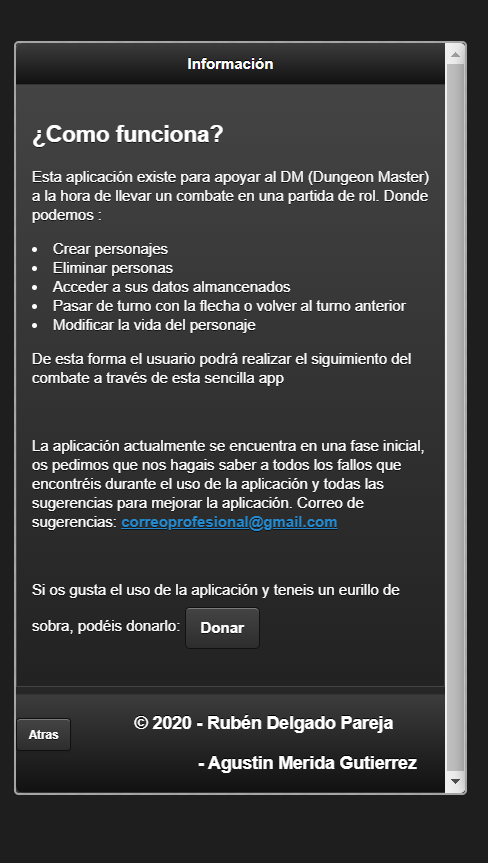

# Kombat Simulator | jQueryMobile
Kombat Simulator, another D&amp;D tracker

Kombat Simulator será una aplicación disponible tanto para dispositivos Android como para computadores. La versión inicial en PC únicamente será accesible desde navegador, pero se realizará en un futuro la implementación de esta como aplicación multiplataforma.

## Diagrama de clases de diseño inicial

## Tecnologías utilizadas para realizar la aplicación

### Tecnologías orientadas al diseño web
La versión inicial ha sido diseñada centrandose principalmente en la versión para dispositivos mobiles. Sin embargo, se ha utilizado un framework centrado en el desarrollo de aplicaciones multiplataforma web orientadas a mobiles para que también sirva en páginas web. La tecnología utilizada en cuestión es **jquery Mobile**, un framework cuya filosofía es la de realizar el diseño para uno, y aplicarlo para todos. Esto significa que lo que nos permite es realizar el diseño orientadonse exclusivamente en como será en mobiles, y que también sirva para navegadores:

* **Aplicación en dispositivos moviles**

* **Aplicación en navegadores**

Para más información acerca de **jquery Mobile**, acceded al siguiente repositorio el cual sirve de guía introductoria para empezar a utilizar el framework: https://github.com/Agumeri/Curso-jQuery-Mobile

### Tecnologías utilizadas para la creación de una API REST

* [**Node js**](https://nodejs.org/es/docs/)
  * body-parser: Middleware para parsear el cuerpo del request
  * cors: Paquete middleware que proporciona conexion 
  * dotenv: Paquete con 0 dependencias que aporta seguridad permitiendo acceso a archivos .env
  * ejs-mate: Paquete que implementar un motor de plantillas donde se escribe el html
  * jquery: Paquete incluye la biblioteca jquery de javascript
  * mongoose: Paquete que ayuda a la conexión con la base de datos de MongoDB
* [**Express**](https://expressjs.com/es/)
* [**MongoDB**](https://github.com/Agumeri/Curso-MongoDB)

## Uso de Kombat Simulator.

A continuación, se explicará brevemente que es lo que se puede hacer con la versión inicial de la aplicación:

* **Añadir personajes**
  Como se vio en las imagenes anteriores, correspondientes a la página principal de la app, hay un botón en el que pone *Añadir personaje*. Si se pulsa, llevará al usuario a otra página con un simple formulario a rellenar, y tras rellenarlo, se deberá pulsar el botón de *Aceptar* (Además esta página tiene abajo el botón *Atras* para volver a la página principal. Los personajes en la página principal estarán ordenados en todo momento de mayor a menor según la iniciativa de estos. El formulario en cuestion es el siguiente: 

* **Acceder y modificar a la información de los personajes**
  Una vez añadidos los personajes, saldrán en la página inicial como se puede ver en la imagen del apartado *Aplicación en dispositivos moviles*. Por defecto, se mostrará el nombre de cada personaje, su vida (HP), su armadura (CA), su iniciativa (INI) y velocidad (VEL). Si queremos saber el resto de información de estos, basta con pulsar en cada uno, y activará un desplegable con el resto de información, además de dos funciones a realizar por cada personaje, eliminarlo, y modificar su vida (esta modificación dependerá ya del usuario, la función en si solo suma vida, siendo esta positiva o negativa): 
  

* **Pasar turnos**
  La aplicación una vez se introduzcan uno o más personajes, indica a cual de ellos les corresponde el turno. Además, hay dos botones que sirven para "pasar" o "retroceder" turno. Si se eliminase el personaje que tenga el turno, se le atribuirá el turno al personaje que tendría el turno después de él.
  

* **Página informativa**
  En la página principal, en la esquina inferior derecha hay un botón que al pulsarlo te envía a una página informativa, la cual explica de que trata la aplicación y cuales son las funciones que se pueden realizar con esta (un breve resumen).
  Además, hay dos enlaces, uno que corresponde al correo que se utilizará para obtener la retrospectiva por parte de los usuarios de la aplicación, y otro que es un botón de donaciones por si estos quieren donar algo a los desarrolladores de la app.
  
 

##### Donaciones
  Si os ha convencido la aplicación y os sobra dinero, podeis donar un euro a los creadores a través del siguiente enlace:
  
  [**Donar**](https://www.youtube.com/watch?v=9CENFPSJwCI)
  
  

----------------------------------------------------------------------------------------------------------------------------------------

#### Practica final de Desarrollo del Software realizada por:
* Rubén Delgado Pareja
* Agustín Mérida Gutiérrez
